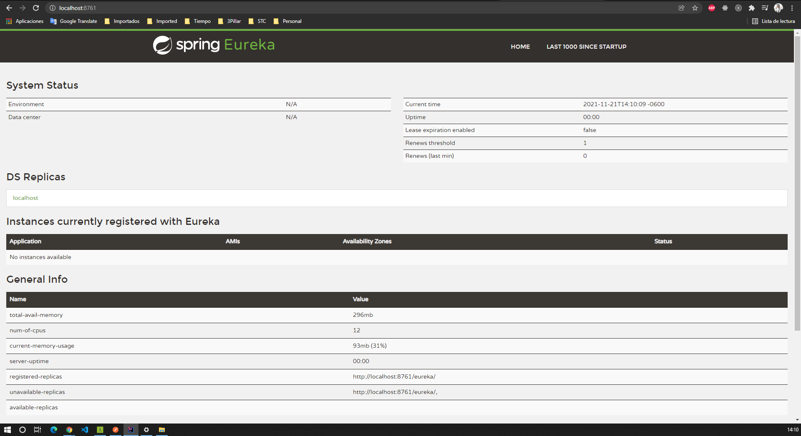
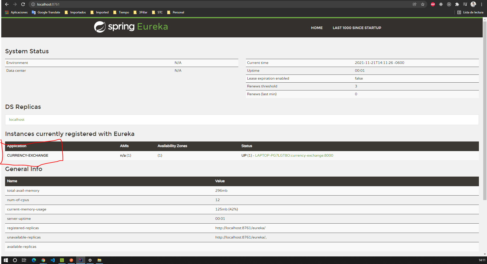
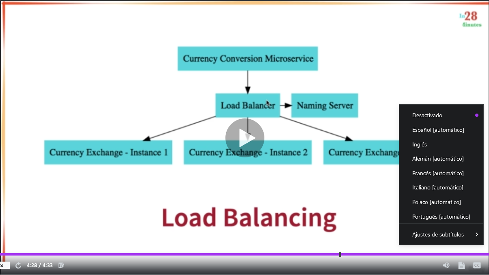
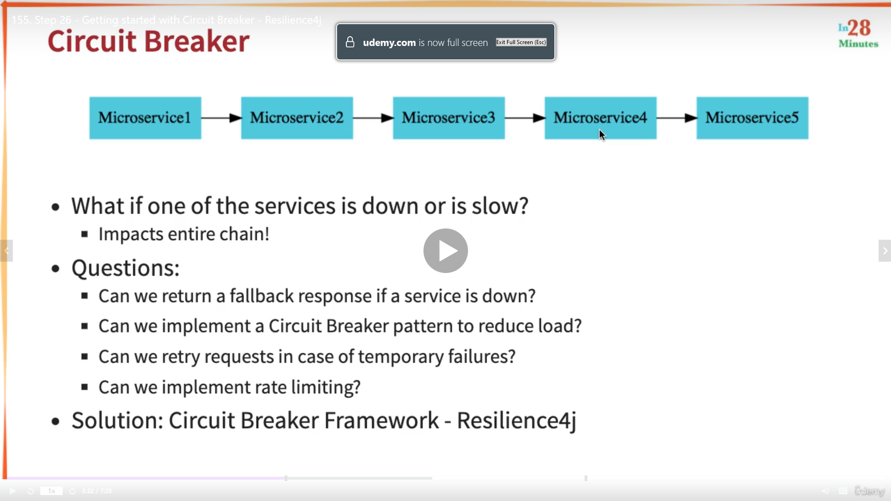

# naming-server
Eureka Naming Server project for UDEMY Microservices Rest course

# Initial Structure of the project


# Ports


# How to Register a microservice in Eureka
- in the POM of the microservice project add the dependency for Eureka client
```
    <dependency>
        <groupId>org.springframework.cloud</groupId>
        <artifactId>spring-cloud-starter-netflix-eureka-client</artifactId>
    </dependency>
```
Additional, just to be sure, you can add the following to the properties file
``eureka.client.serviceUrl.defaultZone = http://localhost:8761/eureka``

Before Add the depdendency in the microservices projects


After...



#Client Side load balancing with Feign using spring-cloud-loadbalancer
- Is included in Eureka client dependency when you uses Feign Clients
- In old versions of Spring Cloud was called Ribbon
- The to implement it is removing the URL from the Feign
    - Then If there is more than one instance of the microservice running, the Spring Clouyd Load Balancer will check with Eureka the number of instances and will balance the load of requests.


# Spring Cloud Gateway to use the same common configuration between microservices
- In a typical Microservices architecture there are a lot of microservices (hundreds, thousands)
- A lot of them share common configurations
- Spring Cloud API Gateway does that work for you
  - In Earlier versions of Spring was called Zuul

# Spring Cloud Gateway to use the same common configuration between microservices
- In a typical Microservices architecture there are a lot of microservices (hundreds, thousands)
- A lot of them share common configurations
- Spring Cloud API Gateway does that work for you
  - In Earlier versions of Spring was called Zuul

Is registered automatically in Eureka, but to be sure, you can configure the properties file
``eureka.client.serviceUrl.defaultZone = http://localhost:8761/eureka``

# Enable the ability to discover microservices talking with EUREKA and using the name convention in Eureka http://localhost:8761 (e.g) CURRENCY-EXCHANGE
```spring.cloud.gateway.discovery.locator.enabled = true```

Allows to talk With Eureka and use the name of the application to go to the service through the name registered
e.g

```
  Original URL  
  http://localhost:8100/currency-conversion-feign/from/USD/to/MXN/quantity/10

  Using Spring Gateway 
  http://localhost:8765/CURRENCY-EXCHANGE/currency-exchange/from/USD/to/MXN

```

To avoid the upper case in the url add the following to properties

``spring.cloud.gateway.discovery.locator.lowerCaseServiceId = true``

Then...
```
  Original URL
  http://localhost:8100/currency-conversion-feign/from/USD/to/MXN/quantity/10
  
  Using Spring Gateway 
  http://localhost:8765/currency-exchange/currency-exchange/from/USD/to/MXN
```

# Circuit Breaker using Resilience4j (Earlier Hystrix)


- Inspired in Netflix Hystrix
- Review Resilience4j site to check if the followind dependencies are the only ones that we need to add:
  - actuator
  - spring boot2
  - spring aop

```
  		<dependency>
			<groupId>org.springframework.boot</groupId>
			<artifactId>spring-boot-starter-actuator</artifactId>
		</dependency>
		
		<dependency>
			<groupId>org.springframework.boot</groupId>
			<artifactId>spring-boot-starter-aop</artifactId>
		</dependency>

		<dependency>
			<groupId>io.github.resilience4j</groupId>
			<artifactId>resilience4j-spring-boot2</artifactId>
		</dependency>
        
```
